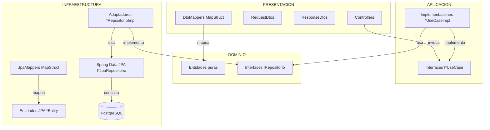
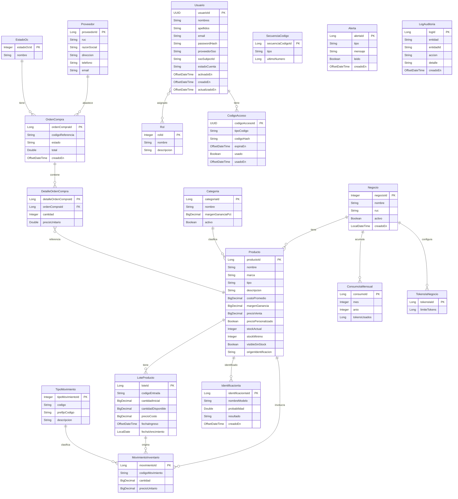

# Design Document — DrinkHouse App

## Overview

DrinkHouse App es una API REST backend para la gestión integral de una licorería/tienda de bebidas.
El sistema cubre: catálogo (productos, categorías, proveedores), inventario (lotes y movimientos),
órdenes de compra, usuarios con roles y códigos de acceso, configuración del negocio,
auditoría automática, alertas internas e identificación de productos mediante IA.

**Stack tecnológico:**
- Java 21 / Spring Boot 4.1.0
- PostgreSQL + Spring Data JPA + Hibernate
- MapStruct 1.6.3 (mapeo entre capas)
- Lombok (reducción de boilerplate)
- Jakarta Validation (validaciones de entrada)
- Convención de idioma: todo el código en **español**

La arquitectura sigue el patrón **Hexagonal (Ports & Adapters)** con cuatro capas:
`dominio`, `aplicacion`, `infraestructura` y `presentacion`.

---

## Architecture

### Diagrama de Arquitectura Hexagonal

```
┌──────────────────────────────────────────────────────────────────────┐
│                         PRESENTACIÓN                                 │
│  *Controller.java  │  *RequestDto.java  │  *ResponseDto.java         │
│  I*DtoMapper.java (MapStruct)                                        │
└───────────────────────────┬──────────────────────────────────────────┘
                            │ usa
┌───────────────────────────▼──────────────────────────────────────────┐
│                         APLICACIÓN                                    │
│  aplicacion/casosuso/entrada/  — Interfaces I*UseCase (puertos)      │
│  aplicacion/casosuso/impl/     — Implementaciones *UseCaseImpl       │
└──────────┬───────────────────────────────────────┬───────────────────┘
           │ usa                                   │ usa
┌──────────▼──────────────┐          ┌─────────────▼───────────────────┐
│       DOMINIO           │          │       INFRAESTRUCTURA           │
│  entidades/             │◄─────────│  persistencia/jpa/              │
│  repositorios/          │          │  persistencia/mapeadores/       │
│  (interfaces de repo)   │          │  persistencia/adaptadores/      │
│                         │          │  repositorio/ (Spring Data JPA) │
└─────────────────────────┘          └─────────────────────────────────┘
```



### Principios de diseño

- **Dependencias hacia el dominio**: infraestructura y presentación dependen de dominio/aplicación, nunca al revés.
- **Puertos (interfaces)**: `IProductoRepositorio`, `IMovimientoRepositorio`, etc. viven en `dominio/repositorios/`.
- **Adaptadores**: `*RepositorioImpl` en `infraestructura/persistencia/adaptadores/` implementan los puertos usando Spring Data JPA.
- **Casos de uso**: orquestan lógica de dominio; son la única capa que llama a repositorios y a servicios auxiliares (SecuenciaCodigo, LogAuditoria, Alertas).
- **Mappers separados por capa**: `I*JpaMapper` entre entidad JPA y entidad dominio; `I*DtoMapper` entre entidad dominio y DTOs REST.

---

## Components and Interfaces

### Interfaces de Casos de Uso (puertos de entrada)

Cada componente gestor expone su puerto como interfaz en `aplicacion/casosuso/entrada/`:

| Interfaz | Gestor | Responsabilidad |
|---|---|---|
| `ICategoriaUseCase` | GestorProductos | CRUD categorías |
| `IProductoUseCase` | GestorProductos | CRUD + búsqueda productos |
| `IProveedorUseCase` | GestorOrdenes | CRUD proveedores |
| `IOrdenCompraUseCase` | GestorOrdenes | Ciclo de vida OC |
| `ILoteProductoUseCase` | GestorInventario | Gestión de lotes |
| `IMovimientoInventarioUseCase` | GestorInventario | Movimientos de stock |
| `ITipoMovimientoUseCase` | GestorInventario | Catálogo tipos movimiento |
| `IUsuarioUseCase` | GestorUsuarios | CRUD usuarios + estados |
| `IRolUseCase` | GestorUsuarios | CRUD roles + asignación |
| `ICodigoAccesoUseCase` | GestorUsuarios | Generación y validación códigos |
| `INegocioUseCase` | GestorNegocio | Configuración del negocio |
| `IAlertaUseCase` | GestorAlertas | Listado y marcado alertas |
| `ILogAuditoriaUseCase` | GestorAuditoria | Registro y consulta logs |
| `IIdentificacionIaUseCase` | GestorIa | Identificación por IA + cuota |
| `ISecuenciaCodigoUseCase` | Sistema | Generación de secuencias únicas |

### Interfaces de Repositorio de Dominio (puertos de salida)

Ubicadas en `dominio/repositorios/`:

```
IAlertaRepositorio          ICategoriaRepositorio       ICodigoAccesoRepositorio
IConsumoIaMensualRepositorio  IIdentificacionIaRepositorio  ILogAuditoriaRepositorio
ILoteProductoRepositorio    IMovimientoInventarioRepositorio  INegocioRepositorio
IOrdenCompraRepositorio     IDetalleOrdenCompraRepositorio  IProductoRepositorio
IProveedorRepositorio       IRolRepositorio             ISecuenciaCodigoRepositorio
ITipoMovimientoRepositorio  ITokensIaNegocioRepositorio  IUsuarioRepositorio
```

### Estructura de paquetes completa

```
com.uisrael.drinkhouse
├── dominio
│   ├── entidades/              ← POJOs puros (sin anotaciones JPA)
│   └── repositorios/           ← interfaces (puertos de salida)
├── aplicacion
│   └── casosuso
│       ├── entrada/            ← interfaces I*UseCase (puertos de entrada)
│       └── impl/               ← *UseCaseImpl
├── infraestructura
│   ├── configuracion/          ← @Configuration, beans, scheduler, AOP
│   ├── persistencia
│   │   ├── jpa/                ← *Entity (anotaciones JPA/Hibernate)
│   │   ├── mapeadores/         ← I*JpaMapper (MapStruct)
│   │   └── adaptadores/        ← *RepositorioImpl
│   └── repositorio/            ← I*JpaRepositorio (Spring Data JPA)
└── presentacion
    ├── controladores/          ← *Controller (@RestController)
    ├── dto
    │   ├── request/            ← *RequestDto (@Valid)
    │   └── response/           ← *ResponseDto
    └── mapeadores/             ← I*DtoMapper (MapStruct)
```

---

## Data Models

### Diagrama de relaciones entre entidades de dominio



### Notas sobre el modelo de datos

- `Producto.stockActual` es un entero que se actualiza sincrónicamente con cada `MovimientoInventario`.
- `LoteProducto.cantidadDisponible` decrece en cada `MovimientoInventario` de tipo SALIDA.
- `SecuenciaCodigo` tiene un campo `tipo` (ej: `"MOVIMIENTO"`, `"OC"`, `"LOTE"`) para distinguir counters.
- `LogAuditoria.detalle` almacena un snapshot JSON de los campos modificados.
- `ConsumoIaMensual` tiene clave compuesta (negocioId, mes, anio) — se crea on-demand la primera vez que se usa IA en ese periodo.
- La relación `Usuario ↔ Rol` es N:M e implementada con tabla intermedia `usuario_rol` a nivel JPA.

---

## Diseño por Requisito — Capas y Endpoints REST

### REQ-1: Gestión de Categorías

**Capa aplicacion:** `ICategoriaUseCase` / `CategoriaUseCaseImpl`

Métodos:
```java
Categoria crearCategoria(Categoria categoria);
Categoria actualizarCategoria(Long id, Categoria categoria);
Categoria buscarPorId(Long id);
List<Categoria> listarCategorias();
void eliminarCategoria(Long id);
```

**Capa presentacion:** `CategoriaController` — base `/api/v1/categorias`

| Método | Ruta | Body | Respuesta | Códigos |
|---|---|---|---|---|
| POST | `/api/v1/categorias` | `CategoriaRequestDto` | `CategoriaResponseDto` | 201, 409 |
| PUT | `/api/v1/categorias/{id}` | `CategoriaRequestDto` | `CategoriaResponseDto` | 200, 404 |
| GET | `/api/v1/categorias/{id}` | — | `CategoriaResponseDto` | 200, 404 |
| GET | `/api/v1/categorias` | — | `List<CategoriaResponseDto>` | 200 |
| DELETE | `/api/v1/categorias/{id}` | — | — | 204, 404, 422 |

**DTOs:**
```java
// CategoriaRequestDto
@NotBlank String nombre;
@NotNull @DecimalMin("0") BigDecimal margenGananciaPct;
Boolean activo; // default true en creación

// CategoriaResponseDto
Long categoriaId;
String nombre;
BigDecimal margenGananciaPct;
Boolean activo;
```

**Auditoría:** `CategoriaUseCaseImpl` llama a `ILogAuditoriaUseCase.registrar(...)` al final de crear/actualizar/eliminar.

### REQ-2: Gestión de Productos

**Capa aplicacion:** `IProductoUseCase` / `ProductoUseCaseImpl`

Métodos:
```java
Producto crearProducto(Producto producto);
Producto actualizarProducto(Long id, Producto producto);
Producto buscarPorId(Long id);
List<Producto> listarProductos();
List<Producto> buscarConFiltros(String nombre, String marca, String tipo, Long categoriaId);
void eliminarProducto(Long id);
```

**Lógica de precio en `ProductoUseCaseImpl`:**
```java
if (!producto.getPrecioPersonalizado()) {
    BigDecimal factor = BigDecimal.ONE.add(
        producto.getMargenGanancia().divide(BigDecimal.valueOf(100)));
    producto.setPrecioVenta(producto.getCostoPromedio().multiply(factor));
}
```

**Capa presentacion:** `ProductoController` — base `/api/v1/productos`

| Método | Ruta | Query params | Respuesta | Códigos |
|---|---|---|---|---|
| POST | `/api/v1/productos` | — | `ProductoResponseDto` | 201, 400, 409 |
| PUT | `/api/v1/productos/{id}` | — | `ProductoResponseDto` | 200, 400, 404 |
| GET | `/api/v1/productos/{id}` | — | `ProductoResponseDto` | 200, 404 |
| GET | `/api/v1/productos` | — | `List<ProductoResponseDto>` | 200 |
| GET | `/api/v1/productos/buscar` | `nombre`, `marca`, `tipo`, `categoriaId` | `List<ProductoResponseDto>` | 200 |
| DELETE | `/api/v1/productos/{id}` | — | — | 204, 404 |

**DTOs:**
```java
// ProductoRequestDto
@NotBlank String nombre;
@NotBlank String marca;
String tipo;
String descripcion;
@NotNull @DecimalMin(value="0", inclusive=false) BigDecimal costoPromedio;
@NotNull @DecimalMin("0") BigDecimal margenGanancia;
BigDecimal precioVenta; // requerido si precioPersonalizado=true
Boolean precioPersonalizado;
Integer stockMinimo;
Boolean visibleSinStock;

// ProductoResponseDto
Long productoId; String nombre; String marca; String tipo;
String descripcion; BigDecimal costoPromedio; BigDecimal margenGanancia;
BigDecimal precioVenta; Boolean precioPersonalizado;
Integer stockActual; Integer stockMinimo; Boolean visibleSinStock;
String origenIdentificacion;
```

### REQ-3: Gestión de Proveedores

**Capa aplicacion:** `IProveedorUseCase` / `ProveedorUseCaseImpl`

| Método | Ruta | Códigos |
|---|---|---|
| POST | `/api/v1/proveedores` | 201, 400, 409 |
| PUT | `/api/v1/proveedores/{id}` | 200, 404 |
| GET | `/api/v1/proveedores/{id}` | 200, 404 |
| GET | `/api/v1/proveedores` | 200 |

**Validación RUC:** `@Pattern(regexp="\\d{13}")` en `ProveedorRequestDto.ruc`.

**DTOs:**
```java
// ProveedorRequestDto
@NotBlank @Pattern(regexp="\\d{13}") String ruc;
@NotBlank String razonSocial;
String direccion;
String telefono;
@Email @NotBlank String email;

// ProveedorResponseDto
Long proveedorId; String ruc; String razonSocial;
String direccion; String telefono; String email;
```

### REQ-4: Gestión de Órdenes de Compra

**Capa aplicacion:** `IOrdenCompraUseCase` / `OrdenCompraUseCaseImpl`

Métodos:
```java
OrdenCompra crearOrden(OrdenCompra orden, List<DetalleOrdenCompra> detalles);
OrdenCompra actualizarOrden(Long id, OrdenCompra orden, List<DetalleOrdenCompra> detalles);
OrdenCompra enviarOrden(Long id);
OrdenCompra recibirOrden(Long id);    // @Transactional — ver sección de transacciones
OrdenCompra anularOrden(Long id);
OrdenCompra buscarPorId(Long id);
List<OrdenCompra> listarConFiltros(String estado, OffsetDateTime desde, OffsetDateTime hasta);
```

| Método | Ruta | Códigos |
|---|---|---|
| POST | `/api/v1/ordenes-compra` | 201, 404, 422 |
| PUT | `/api/v1/ordenes-compra/{id}` | 200, 404, 422 |
| PATCH | `/api/v1/ordenes-compra/{id}/enviar` | 200, 422 |
| PATCH | `/api/v1/ordenes-compra/{id}/recibir` | 200, 422 |
| PATCH | `/api/v1/ordenes-compra/{id}/anular` | 200, 422 |
| GET | `/api/v1/ordenes-compra/{id}` | 200, 404 |
| GET | `/api/v1/ordenes-compra` | 200 |

**Cálculo de total en `OrdenCompraUseCaseImpl`:**
```java
double total = detalles.stream()
    .mapToDouble(d -> d.getCantidad() * d.getPrecioUnitario())
    .sum();
orden.setTotal(total);
```

### REQ-5: Gestión de Lotes de Producto

**Capa aplicacion:** `ILoteProductoUseCase` / `LoteProductoUseCaseImpl`

| Método | Ruta | Query params | Códigos |
|---|---|---|---|
| POST | `/api/v1/lotes` | — | 201, 400, 404 |
| GET | `/api/v1/lotes/producto/{productoId}` | — | 200 |
| GET | `/api/v1/lotes/{id}` | — | 200, 404 |
| GET | `/api/v1/lotes/proximos-vencer` | `dias` (default 7) | 200 |

**Lógica de creación:**
```java
lote.setCantidadDisponible(lote.getCantidadInicial());
lote.setFechaIngreso(OffsetDateTime.now());
String codigo = "LOTE-" + String.format("%08d", secuenciaCodigoUseCase.siguiente("LOTE"));
lote.setCodigoEntrada(codigo);
```

### REQ-6: Movimientos de Inventario

**Capa aplicacion:** `IMovimientoInventarioUseCase` / `MovimientoInventarioUseCaseImpl`

| Método | Ruta | Query params | Códigos |
|---|---|---|---|
| POST | `/api/v1/movimientos` | — | 201, 400, 404, 422 |
| GET | `/api/v1/movimientos/producto/{productoId}` | `tipo`, `desde`, `hasta` | 200 |

**Lógica de registro (dentro de `@Transactional`):**

- ENTRADA: `producto.setStockActual(stock + cantidad)`
- SALIDA: verificar `lote.cantidadDisponible >= cantidad` → `lote.cantidadDisponible -= cantidad` y `producto.stockActual -= cantidad`
- AJUSTE: `producto.setStockActual(stock + cantidad)` (cantidad puede ser negativa)

Post-movimiento: si `producto.stockActual <= producto.stockMinimo` → llamar a `alertaUseCase.crearAlertaStockBajo(producto)`.

**DTOs:**
```java
// MovimientoRequestDto
@NotNull Long productoId;
Long loteId;          // requerido para SALIDA
@NotNull Long tipoMovimientoId;
@NotNull @DecimalMin(value="0", inclusive=false) BigDecimal cantidad; // positivo, ajuste puede serlo
BigDecimal precioUnitario;

// MovimientoResponseDto
Long movimientoId; String codigoMovimiento; Long productoId; Long loteId;
String tipoMovimiento; BigDecimal cantidad; BigDecimal precioUnitario;
OffsetDateTime creadoEn;
```

### REQ-7: Tipos de Movimiento

**Capa presentacion:** `TipoMovimientoController` — base `/api/v1/tipos-movimiento`

| Método | Ruta | Códigos |
|---|---|---|
| POST | `/api/v1/tipos-movimiento` | 201, 409 |
| GET | `/api/v1/tipos-movimiento` | 200 |
| GET | `/api/v1/tipos-movimiento/{id}` | 200, 404 |

### REQ-8: Gestión de Usuarios

**Capa presentacion:** `UsuarioController` — base `/api/v1/usuarios`

| Método | Ruta | Query params | Códigos |
|---|---|---|---|
| POST | `/api/v1/usuarios` | — | 201, 400, 409 |
| PATCH | `/api/v1/usuarios/{id}/activar` | — | 200, 404, 422 |
| PATCH | `/api/v1/usuarios/{id}/desactivar` | — | 200, 404, 422 |
| GET | `/api/v1/usuarios/{id}` | — | 200, 404 |
| GET | `/api/v1/usuarios` | `estadoCuenta` | 200 |
| PUT | `/api/v1/usuarios/{id}` | — | 200, 400, 404 |

**Nota de seguridad:** `UsuarioResponseDto` NO incluye el campo `passwordHash`.

**DTOs:**
```java
// UsuarioRequestDto
@NotBlank String nombres;
@NotBlank String apellidos;
@Email @NotBlank String email;
String passwordHash;      // opcional si hay SSO
String proveedorSso;
String ssoSubjectId;

// UsuarioResponseDto
UUID usuarioId; String nombres; String apellidos; String email;
String proveedorSso; String estadoCuenta;
OffsetDateTime activadoEn; OffsetDateTime creadoEn;
// SIN passwordHash
```

### REQ-9: Gestión de Roles

**Capa presentacion:** `RolController` — base `/api/v1/roles`

| Método | Ruta | Códigos |
|---|---|---|
| POST | `/api/v1/roles` | 201, 409 |
| PUT | `/api/v1/roles/{id}` | 200, 404 |
| GET | `/api/v1/roles` | 200 |
| POST | `/api/v1/roles/{rolId}/usuarios/{usuarioId}` | 200, 404 |
| DELETE | `/api/v1/roles/{rolId}/usuarios/{usuarioId}` | 204, 404 |

### REQ-10: Códigos de Acceso

**Capa presentacion:** `CodigoAccesoController` — base `/api/v1/codigos-acceso`

| Método | Ruta | Códigos |
|---|---|---|
| POST | `/api/v1/codigos-acceso` | 201 |
| POST | `/api/v1/codigos-acceso/validar` | 200, 410 |

**Lógica de generación:**
```java
codigo.setCodigoHash(UUID.randomUUID().toString());
codigo.setExpiraEn(OffsetDateTime.now().plusHours(24));
codigo.setUsado(false);
```

**DTOs:**
```java
// CodigoAccesoRequestDto
@NotBlank String tipoCodigo;    // INVITACION | RECUPERACION
@NotNull UUID usuarioId;

// ValidarCodigoRequestDto
@NotBlank String codigoHash;

// CodigoAccesoResponseDto
UUID codigoAccesoId; String tipoCodigo; OffsetDateTime expiraEn; Boolean usado;
```

### REQ-11: Configuración del Negocio

**Capa presentacion:** `NegocioController` — base `/api/v1/negocio`

| Método | Ruta | Códigos |
|---|---|---|
| POST | `/api/v1/negocio` | 201, 400, 409 |
| PUT | `/api/v1/negocio/{id}` | 200, 400, 404 |
| GET | `/api/v1/negocio/activo` | 200, 404 |
| GET | `/api/v1/negocio/{id}` | 200, 404 |

### REQ-12: Alertas del Sistema

**Capa presentacion:** `AlertaController` — base `/api/v1/alertas`

| Método | Ruta | Query params | Códigos |
|---|---|---|---|
| GET | `/api/v1/alertas` | `tipo`, `leido` | 200 |
| PATCH | `/api/v1/alertas/{id}/leer` | — | 200, 404 |
| GET | `/api/v1/alertas/no-leidas/conteo` | — | 200 |

**Scheduler de vencimientos** en `infraestructura/configuracion/AlertaScheduler.java`:
```java
@Scheduled(cron = "0 0 7 * * *")   // diariamente a las 07:00
public void verificarVencimientos() {
    LocalDate limite = LocalDate.now().plusDays(7);
    List<LoteProducto> lotes = loteRepositorio.findProximosAVencer(limite);
    lotes.forEach(l -> alertaUseCase.crearAlertaVencimientoProximo(l));
}
```

### REQ-13: Registro de Auditoría

**Capa presentacion:** `LogAuditoriaController` — base `/api/v1/auditoria`

| Método | Ruta | Query params | Códigos |
|---|---|---|---|
| GET | `/api/v1/auditoria` | `entidad`, `accion`, `desde`, `hasta` | 200 |
| GET | `/api/v1/auditoria/entidad/{entidadId}` | — | 200 |

No existen endpoints POST, PUT ni DELETE para `LogAuditoria` (inmutabilidad garantizada).

**Servicio de auditoría:** `LogAuditoriaUseCaseImpl.registrar(String entidad, String entidadId, String accion, Object detalle)` serializa `detalle` a JSON con Jackson antes de persistir.

### REQ-14: Identificación de Productos mediante IA

**Capa presentacion:** `IdentificacionIaController` — base `/api/v1/ia`

| Método | Ruta | Query params | Códigos |
|---|---|---|---|
| POST | `/api/v1/ia/identificar` | — | 201, 400, 429 |
| GET | `/api/v1/ia/historial` | `productoId`, `desde`, `hasta` | 200 |

**Lógica de nivel de confianza en `IdentificacionIaUseCaseImpl`:**
```java
String confianza = identificacion.getProbabilidad() >= 0.80 ? "ALTA" : "BAJA";
```

**Control de cuota:**
```java
ConsumoIaMensual consumo = consumoRepo.findByNegocioYMes(negocioId, mes, anio)
    .orElse(new ConsumoIaMensual(negocioId, mes, anio, 0L));
TokensIaNegocio limite = tokensRepo.findByNegocioId(negocioId);
if (consumo.getTokensUsados() >= limite.getLimiteTokens()) {
    throw new CuotaIaExcedidaException("Cuota mensual de IA agotada");
}
```

**DTOs:**
```java
// IdentificacionIaRequestDto
@NotBlank String imagenBase64;
String formatoImagen;   // JPEG | PNG | WEBP

// IdentificacionIaResponseDto
Long identificacionIaId; String nombreModelo; Double probabilidad;
String resultado; String nivelConfianza; OffsetDateTime creadoEn;
```

### REQ-15: Secuencias de Códigos

**Diseño de atomicidad con `@Version` (Optimistic Locking):**

`SecuenciaCodigoEntity` incluye un campo `@Version Long version`. El método `siguiente(tipo)` en `SecuenciaCodigoUseCaseImpl`:

```java
@Transactional
public Long siguiente(String tipo) {
    int intentos = 0;
    while (intentos < 3) {
        try {
            SecuenciaCodigo seq = secuenciaRepo.findByTipo(tipo)
                .orElseThrow(() -> new RecursoNoEncontradoException("Secuencia"));
            long numero = seq.getUltimoNumero() + 1;
            seq.setUltimoNumero(numero);
            secuenciaRepo.guardar(seq);   // dispara @Version check
            return numero;
        } catch (OptimisticLockingFailureException ex) {
            intentos++;
        }
    }
    throw new ServicioNoDisponibleException("No se pudo generar secuencia tras 3 intentos");
}
```

**Formato de códigos:**

| Entidad | Formato | Ejemplo |
|---|---|---|
| `MovimientoInventario` | `{prefijoCodigo}{número:08d}` | `ENT00000001` |
| `OrdenCompra` | `OC-{número:08d}` | `OC-00000001` |
| `LoteProducto` | `LOTE-{número:08d}` | `LOTE-00000001` |

### REQ-16: Consistencia Transaccional

**Fronteras `@Transactional`:**

| Operación | Frontera | Cambios involucrados |
|---|---|---|
| `recibirOrden(id)` | `OrdenCompraUseCaseImpl` | OC → RECIBIDA + N LoteProducto + N stockActual |
| `registrarMovimientoSalida(...)` | `MovimientoInventarioUseCaseImpl` | MovimientoInventario + lote.cantidadDisponible + producto.stockActual |
| `crearOrden(...)` | `OrdenCompraUseCaseImpl` | OrdenCompra + N DetalleOrdenCompra + codigoReferencia |
| `crearLote(...)` | `LoteProductoUseCaseImpl` | LoteProducto + codigoEntrada (secuencia) |

Todas las operaciones compuestas usan `@Transactional` en el método del `*UseCaseImpl`. Los repositorios no necesitan `@Transactional` propio (heredan la transacción del llamador).

---

## Error Handling

### Estructura de respuesta de error uniforme

Todas las respuestas de error siguen el mismo contrato JSON:

```json
{
  "timestamp": "2025-01-15T10:30:00Z",
  "status": 422,
  "error": "Unprocessable Entity",
  "message": "No se puede eliminar la categoría porque tiene productos asociados"
}
```

**Implementación:** `GlobalExceptionHandler` con `@RestControllerAdvice` en `presentacion/controladores/`.

```java
@RestControllerAdvice
public class GlobalExceptionHandler {

    @ExceptionHandler(RecursoNoEncontradoException.class)
    public ResponseEntity<ErrorResponseDto> manejarNoEncontrado(RecursoNoEncontradoException ex) {
        return ResponseEntity.status(404).body(construirError(404, "Not Found", ex.getMessage()));
    }

    @ExceptionHandler(ConflictoUnicoException.class)
    public ResponseEntity<ErrorResponseDto> manejarConflicto(ConflictoUnicoException ex) {
        return ResponseEntity.status(409).body(construirError(409, "Conflict", ex.getMessage()));
    }

    @ExceptionHandler(ReglaNegocioException.class)
    public ResponseEntity<ErrorResponseDto> manejarRegla(ReglaNegocioException ex) {
        return ResponseEntity.status(422).body(construirError(422, "Unprocessable Entity", ex.getMessage()));
    }

    @ExceptionHandler(MethodArgumentNotValidException.class)
    public ResponseEntity<ErrorResponseDto> manejarValidacion(MethodArgumentNotValidException ex) {
        String campo = ex.getBindingResult().getFieldErrors().get(0).getField();
        return ResponseEntity.status(400).body(
            construirError(400, "Bad Request", "Campo inválido: " + campo));
    }

    @ExceptionHandler(HttpMessageNotReadableException.class)
    public ResponseEntity<ErrorResponseDto> manejarJsonMalFormado(HttpMessageNotReadableException ex) {
        return ResponseEntity.status(400).body(construirError(400, "Bad Request", "JSON mal formado"));
    }

    @ExceptionHandler(CuotaIaExcedidaException.class)
    public ResponseEntity<ErrorResponseDto> manejarCuotaIa(CuotaIaExcedidaException ex) {
        return ResponseEntity.status(429).body(construirError(429, "Too Many Requests", ex.getMessage()));
    }

    @ExceptionHandler(Exception.class)
    public ResponseEntity<ErrorResponseDto> manejarGeneral(Exception ex) {
        return ResponseEntity.status(500).body(construirError(500, "Internal Server Error",
            "Error interno. Contacte al administrador."));
    }
}
```

**Excepciones de dominio** (paquete `dominio/excepciones/`):
- `RecursoNoEncontradoException` → 404
- `ConflictoUnicoException` → 409
- `ReglaNegocioException` → 422
- `CuotaIaExcedidaException` → 429
- `ServicioNoDisponibleException` → 503

**DTO de error:**
```java
// ErrorResponseDto
OffsetDateTime timestamp;
int status;
String error;
String message;
```

---

## Correctness Properties

*Una propiedad es una característica o comportamiento que debe cumplirse en todas las ejecuciones válidas del sistema — esencialmente, una declaración formal sobre lo que el sistema debe hacer. Las propiedades sirven como puente entre las especificaciones legibles por humanos y las garantías de corrección verificables automáticamente.*

Las siguientes propiedades fueron derivadas del análisis de criterios de aceptación (prework). Se implementarán usando **jqwik** (property-based testing para Java/JUnit 5), con un mínimo de 100 iteraciones cada una.

---

### Property 1: Cálculo de precio de venta

*Para cualquier* producto con `costoPromedio > 0` y `margenGanancia >= 0` donde `precioPersonalizado = false`, el `precioVenta` calculado debe ser exactamente `costoPromedio * (1 + margenGanancia / 100)`.

**Validates: Requirements 2.1**

---

### Property 2: Precio personalizado no se recalcula

*Para cualquier* producto con `precioPersonalizado = true` y un `precioVenta` dado, el valor almacenado de `precioVenta` debe ser idéntico al provisto, sin importar los valores de `costoPromedio` ni `margenGanancia`.

**Validates: Requirements 2.2**

---

### Property 3: Filtros de búsqueda de productos son correctos

*Para cualquier* conjunto de productos y cualquier combinación de filtros (`nombre`, `marca`, `tipo`, `categoriaId`), todos los productos retornados deben satisfacer simultáneamente todos los filtros provistos (ningún resultado fuera de filtro).

**Validates: Requirements 2.6**

---

### Property 4: Validación de formato RUC

*Para cualquier* string que no sea exactamente 13 dígitos numéricos, el sistema debe rechazar la solicitud con HTTP 400.

**Validates: Requirements 3.6, 11.5**

---

### Property 5: Total de orden de compra

*Para cualquier* lista de `DetalleOrdenCompra` con cantidades y precios positivos, el `total` de la `OrdenCompra` debe ser exactamente la suma de `cantidad × precioUnitario` de cada detalle.

**Validates: Requirements 4.1**

---

### Property 6: Recepción de OC incrementa stock correctamente

*Para cualquier* `OrdenCompra` con N detalles, al recibirla, el `stockActual` de cada `Producto` involucrado debe incrementarse exactamente en la `cantidad` del detalle correspondiente.

**Validates: Requirements 4.4**

---

### Property 7: Filtros de listado de órdenes son correctos

*Para cualquier* conjunto de órdenes de compra y filtros de estado y/o rango de fechas, todos los resultados retornados deben cumplir todos los filtros provistos.

**Validates: Requirements 4.7**

---

### Property 8: Invariante de creación de lote

*Para cualquier* `LoteProducto` recién creado, su `cantidadDisponible` debe ser igual a su `cantidadInicial`.

**Validates: Requirements 5.1**

---

### Property 9: Ordenamiento FIFO de lotes

*Para cualquier* conjunto de lotes de un mismo producto, el resultado de la consulta por `productoId` debe estar ordenado de manera que `fechaIngreso[i] <= fechaIngreso[i+1]` para todo índice `i`.

**Validates: Requirements 5.2**

---

### Property 10: Filtro de lotes próximos a vencer

*Para cualquier* conjunto de lotes y valor `N > 0`, todos los lotes retornados por la consulta deben tener `fechaVencimiento <= hoy + N días` y `cantidadDisponible > 0`.

**Validates: Requirements 5.4**

---

### Property 11: Movimiento ENTRADA incrementa stock

*Para cualquier* `Producto` con `stockActual = S` y una entrada de `cantidad = C > 0`, después del movimiento el `stockActual` debe ser exactamente `S + C`.

**Validates: Requirements 6.1**

---

### Property 12: Movimiento SALIDA decrementa stock y lote simultáneamente

*Para cualquier* lote con `cantidadDisponible = D` y producto con `stockActual = S`, y una salida válida de `cantidad C (0 < C <= D)`, después del movimiento `cantidadDisponible = D - C` y `stockActual = S - C`.

**Validates: Requirements 6.2**

---

### Property 13: Movimiento AJUSTE actualiza stock con cantidad signed

*Para cualquier* producto con `stockActual = S` y un ajuste con `cantidad = C` (positivo o negativo), después del ajuste `stockActual = S + C`.

**Validates: Requirements 6.3**

---

### Property 14: Filtros de movimientos son correctos y ordenados

*Para cualquier* conjunto de movimientos y filtros de `tipo` y rango de fechas, todos los resultados deben satisfacer los filtros y estar ordenados por `creadoEn` descendente.

**Validates: Requirements 6.4**

---

### Property 15: Alerta STOCK_BAJO se genera post-movimiento

*Para cualquier* producto cuyo `stockActual` quede `<= stockMinimo` después de registrar cualquier movimiento, debe existir en la base de datos al menos una `Alerta` de tipo `STOCK_BAJO` referenciando ese producto.

**Validates: Requirements 6.5, 12.1**

---

### Property 16: PasswordHash nunca se expone en respuestas

*Para cualquier* `Usuario` con `passwordHash` no nulo, el `UsuarioResponseDto` retornado por cualquier endpoint nunca debe contener el campo `passwordHash`.

**Validates: Requirements 8.4**

---

### Property 17: Filtro de usuarios por estado es correcto

*Para cualquier* conjunto de usuarios y filtro de `estadoCuenta`, todos los usuarios retornados deben tener el estado solicitado.

**Validates: Requirements 8.5**

---

### Property 18: Validación de formato de email

*Para cualquier* string que no sea un email con formato válido (conteniendo `@` y dominio), el sistema debe rechazar la solicitud de creación de usuario con HTTP 400.

**Validates: Requirements 8.8**

---

### Property 19: CodigoAcceso expira en 24 horas exactas

*Para cualquier* `CodigoAcceso` generado, `expiraEn` debe estar en el rango `[ahora + 23h59m, ahora + 24h01m]` y `usado` debe ser `false`.

**Validates: Requirements 10.1**

---

### Property 20: Validación de código no-expirado y no-usado es exitosa

*Para cualquier* `CodigoAcceso` con `usado = false` y `expiraEn > ahora`, la operación de validación debe retornar éxito.

**Validates: Requirements 10.2**

---

### Property 21: Código marcado como usado tras validación exitosa

*Para cualquier* `CodigoAcceso` en estado válido (no usado, no expirado), después de una validación exitosa `usado` debe ser `true`.

**Validates: Requirements 10.3**

---

### Property 22: Alerta VENCIMIENTO_PROXIMO cubre todos los lotes elegibles

*Para cualquier* conjunto de lotes, después de ejecutar la verificación periódica, debe existir una `Alerta` de tipo `VENCIMIENTO_PROXIMO` por cada lote cuya `fechaVencimiento <= hoy + 7 días` y `cantidadDisponible > 0`.

**Validates: Requirements 12.2**

---

### Property 23: Filtros de alertas y orden cronológico inverso

*Para cualquier* conjunto de alertas y filtros de `tipo` y/o `leido`, todos los resultados deben satisfacer los filtros y estar ordenados por `creadoEn` descendente.

**Validates: Requirements 12.3**

---

### Property 24: Conteo de alertas no leídas es exacto

*Para cualquier* conjunto de alertas en la base de datos, el endpoint de conteo debe retornar exactamente el número de alertas con `leido = false`.

**Validates: Requirements 12.5**

---

### Property 25: LogAuditoria contiene todos los campos requeridos

*Para cualquier* operación de escritura sobre las entidades auditadas, el `LogAuditoria` persistido debe contener: `entidad` no nulo, `entidadId` no nulo, `accion` en `{CREAR, ACTUALIZAR, ELIMINAR}`, `detalle` en formato JSON válido, y `creadoEn` no nulo.

**Validates: Requirements 13.1, 13.2**

---

### Property 26: Filtros de LogAuditoria son correctos

*Para cualquier* conjunto de logs y filtros de `entidad`, `accion` y rango de fechas, todos los resultados retornados deben satisfacer todos los filtros provistos.

**Validates: Requirements 13.3**

---

### Property 27: Clasificación de confianza de IA

*Para cualquier* valor `Double p` en `[0.0, 1.0]`, si `p >= 0.80` la confianza debe ser `"ALTA"` y si `p < 0.80` la confianza debe ser `"BAJA"`.

**Validates: Requirements 14.2, 14.3**

---

### Property 28: Acumulación de tokens de IA

*Para cualquier* negocio con `tokensUsados = T` antes de una identificación que consume `K` tokens, después de la identificación `tokensUsados = T + K`.

**Validates: Requirements 14.4**

---

### Property 29: Cuota de IA rechaza cuando consumo >= límite

*Para cualquier* negocio con `tokensUsados >= limiteTokens`, toda solicitud de identificación debe ser rechazada con HTTP 429.

**Validates: Requirements 14.5**

---

### Property 30: Atomicidad de la secuencia de códigos bajo concurrencia

*Para cualquier* número `N` de invocaciones concurrentes a `ISecuenciaCodigoUseCase.siguiente(tipo)`, los `N` valores retornados deben ser todos distintos (sin duplicados).

**Validates: Requirements 15.1**

---

### Property 31: Formato de código de movimiento

*Para cualquier* `prefijoCodigo` y número de secuencia `n`, el `codigoMovimiento` generado debe ser igual a `prefijoCodigo + String.format("%08d", n)`.

**Validates: Requirements 15.2, 15.3, 15.4**

---

### Property 32: Estructura de respuesta de error uniforme

*Para cualquier* error retornado por la API (HTTP 400, 404, 409, 410, 422, 429, 500, 503), el cuerpo JSON debe contener los campos `timestamp`, `status`, `error` y `message`.

**Validates: Requirements 16.4**

---

### Property 33: Auditoría completa en todas las escrituras

*Para cualquier* operación de creación, actualización o eliminación sobre `Producto`, `Categoria`, `Proveedor`, `OrdenCompra`, `MovimientoInventario`, `Usuario`, `CodigoAcceso` o `Negocio`, siempre debe existir un `LogAuditoria` correspondiente con `entidadId` correcto y `accion` correcta.

**Validates: Requirements 1.8, 2.10, 3.7, 4.11, 6.8, 8.10, 10.6, 11.7, 13.1**

---

## Testing Strategy

### Enfoque dual: tests de ejemplo + tests de propiedad

**Tests de ejemplo (JUnit 5 + Spring Boot Test):**
- Cubren los casos CRUD concretos (REQ-1 a REQ-13 criterios EXAMPLE)
- Verifican transiciones de estado específicas (BORRADOR→ENVIADA, PENDIENTE→ACTIVO, etc.)
- Verifican edge cases: nombre duplicado, RUC inválido, código ya usado, stock insuficiente
- Usan `@DataJpaTest` para la capa de persistencia y `@WebMvcTest` para controllers

**Tests de propiedad (jqwik 1.8.x):**
- Cubren las 33 propiedades definidas en la sección anterior
- Mínimo **100 iteraciones** por propiedad (`@Property(tries = 100)`)
- Generadores en español: `@ForAll @Positive BigDecimal costoPromedio`, `@ForAll List<DetalleOrdenCompra> detalles`, etc.
- Cada test referencia su propiedad de diseño:

```java
// Feature: drinkhouse-app, Propiedad 1: Cálculo de precio de venta
@Property(tries = 100)
void calculoPrecioVentaEsCorrecto(
    @ForAll @Positive BigDecimal costoPromedio,
    @ForAll @DoubleRange(min = 0, max = 500) double margen) {
    Producto p = new Producto();
    p.setCostoPromedio(costoPromedio);
    p.setMargenGanancia(BigDecimal.valueOf(margen));
    p.setPrecioPersonalizado(false);
    productoUseCaseImpl.calcularPrecioVenta(p);
    BigDecimal esperado = costoPromedio.multiply(
        BigDecimal.ONE.add(BigDecimal.valueOf(margen / 100)));
    assertThat(p.getPrecioVenta()).isEqualByComparingTo(esperado);
}
```

### Tests de integración

- `@SpringBootTest` + Testcontainers (PostgreSQL) para validar:
  - Atomicidad de `recibirOrden` (rollback si falla creación de lote)
  - Atomicidad de movimiento SALIDA
  - Concurrencia de `SecuenciaCodigo` (N threads, N valores distintos)
  - Inmutabilidad de `LogAuditoria` (sin endpoints PUT/DELETE)

### Tests de humo (Smoke)

- Verificar que no existen rutas `PUT /api/v1/auditoria/{id}` ni `DELETE /api/v1/auditoria/{id}`
- Verificar que el contexto de Spring Boot arranca sin errores de configuración

### Configuración de jqwik

Agregar dependencia al `pom.xml`:
```xml
<dependency>
    <groupId>net.jqwik</groupId>
    <artifactId>jqwik</artifactId>
    <version>1.8.5</version>
    <scope>test</scope>
</dependency>
```

---

## Appendix: Resumen de todos los Endpoints REST

| Método | Ruta | Descripción | Códigos |
|---|---|---|---|
| POST | `/api/v1/categorias` | Crear categoría | 201, 409 |
| PUT | `/api/v1/categorias/{id}` | Actualizar categoría | 200, 404 |
| GET | `/api/v1/categorias/{id}` | Obtener categoría | 200, 404 |
| GET | `/api/v1/categorias` | Listar categorías | 200 |
| DELETE | `/api/v1/categorias/{id}` | Eliminar categoría | 204, 422 |
| POST | `/api/v1/productos` | Crear producto | 201, 400, 409 |
| PUT | `/api/v1/productos/{id}` | Actualizar producto | 200, 400, 404 |
| GET | `/api/v1/productos/{id}` | Obtener producto | 200, 404 |
| GET | `/api/v1/productos` | Listar productos | 200 |
| GET | `/api/v1/productos/buscar` | Buscar con filtros | 200 |
| DELETE | `/api/v1/productos/{id}` | Eliminar producto | 204, 404 |
| POST | `/api/v1/proveedores` | Crear proveedor | 201, 400, 409 |
| PUT | `/api/v1/proveedores/{id}` | Actualizar proveedor | 200, 404 |
| GET | `/api/v1/proveedores/{id}` | Obtener proveedor | 200, 404 |
| GET | `/api/v1/proveedores` | Listar proveedores | 200 |
| POST | `/api/v1/ordenes-compra` | Crear OC | 201, 404, 422 |
| PUT | `/api/v1/ordenes-compra/{id}` | Actualizar OC (BORRADOR) | 200, 422 |
| PATCH | `/api/v1/ordenes-compra/{id}/enviar` | Enviar OC | 200, 422 |
| PATCH | `/api/v1/ordenes-compra/{id}/recibir` | Recibir OC | 200, 422 |
| PATCH | `/api/v1/ordenes-compra/{id}/anular` | Anular OC | 200, 422 |
| GET | `/api/v1/ordenes-compra/{id}` | Obtener OC | 200, 404 |
| GET | `/api/v1/ordenes-compra` | Listar OC con filtros | 200 |
| POST | `/api/v1/lotes` | Crear lote | 201, 400, 404 |
| GET | `/api/v1/lotes/producto/{productoId}` | Lotes de producto (FIFO) | 200 |
| GET | `/api/v1/lotes/{id}` | Obtener lote | 200, 404 |
| GET | `/api/v1/lotes/proximos-vencer` | Lotes próximos a vencer | 200 |
| POST | `/api/v1/movimientos` | Registrar movimiento | 201, 400, 404, 422 |
| GET | `/api/v1/movimientos/producto/{productoId}` | Movimientos por producto | 200 |
| POST | `/api/v1/tipos-movimiento` | Crear tipo | 201, 409 |
| GET | `/api/v1/tipos-movimiento` | Listar tipos | 200 |
| GET | `/api/v1/tipos-movimiento/{id}` | Obtener tipo | 200, 404 |
| POST | `/api/v1/usuarios` | Crear usuario | 201, 400, 409 |
| PATCH | `/api/v1/usuarios/{id}/activar` | Activar usuario | 200, 422 |
| PATCH | `/api/v1/usuarios/{id}/desactivar` | Desactivar usuario | 200, 422 |
| GET | `/api/v1/usuarios/{id}` | Obtener usuario | 200, 404 |
| GET | `/api/v1/usuarios` | Listar usuarios | 200 |
| PUT | `/api/v1/usuarios/{id}` | Actualizar usuario | 200, 400, 404 |
| POST | `/api/v1/roles` | Crear rol | 201, 409 |
| PUT | `/api/v1/roles/{id}` | Actualizar rol | 200, 404 |
| GET | `/api/v1/roles` | Listar roles | 200 |
| POST | `/api/v1/roles/{rolId}/usuarios/{usuarioId}` | Asignar rol | 200, 404 |
| DELETE | `/api/v1/roles/{rolId}/usuarios/{usuarioId}` | Revocar rol | 204, 404 |
| POST | `/api/v1/codigos-acceso` | Generar código | 201 |
| POST | `/api/v1/codigos-acceso/validar` | Validar código | 200, 410 |
| POST | `/api/v1/negocio` | Crear negocio | 201, 400, 409 |
| PUT | `/api/v1/negocio/{id}` | Actualizar negocio | 200, 400, 404 |
| GET | `/api/v1/negocio/activo` | Obtener negocio activo | 200, 404 |
| GET | `/api/v1/negocio/{id}` | Obtener negocio | 200, 404 |
| GET | `/api/v1/alertas` | Listar alertas con filtros | 200 |
| PATCH | `/api/v1/alertas/{id}/leer` | Marcar alerta como leída | 200, 404 |
| GET | `/api/v1/alertas/no-leidas/conteo` | Conteo alertas no leídas | 200 |
| GET | `/api/v1/auditoria` | Consultar logs con filtros | 200 |
| GET | `/api/v1/auditoria/entidad/{entidadId}` | Logs por entidadId | 200 |
| POST | `/api/v1/ia/identificar` | Identificar producto con IA | 201, 400, 429 |
| GET | `/api/v1/ia/historial` | Historial de identificaciones | 200 |
